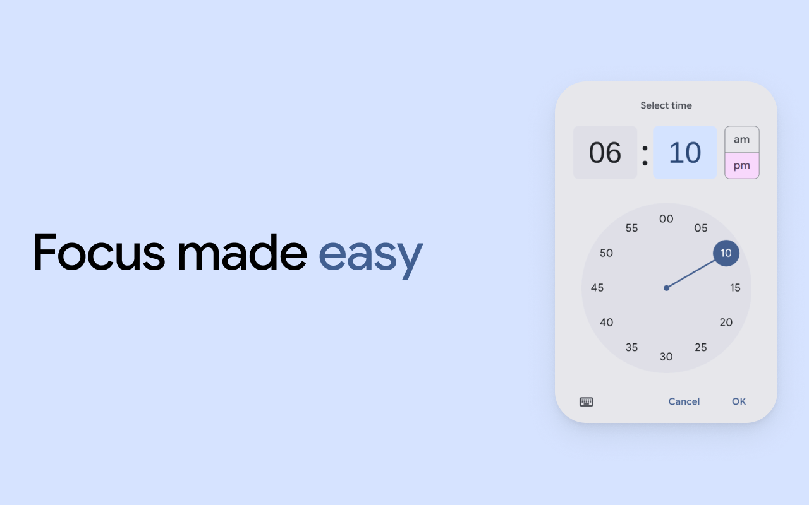
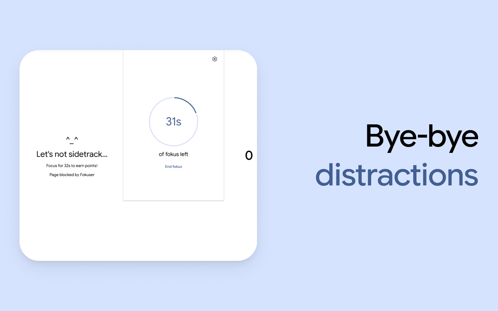
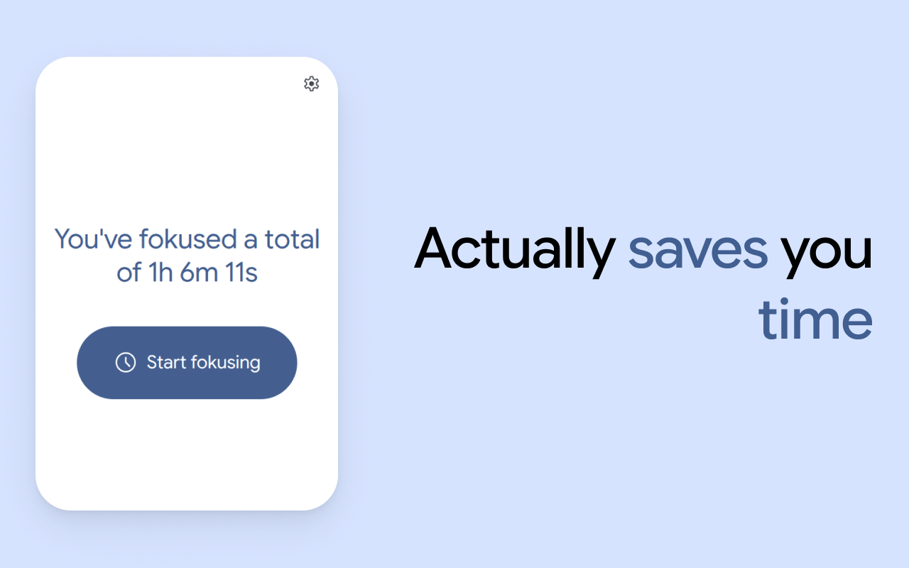

<div align="center">


<h1 align="center">Fokuser</h1>

<p align="center">
A FOSS M3E Chrome Extension <b>site blocker</b> and <b>focus timer</b>.
</p>
<p><a href="https://chromewebstore.google.com/detail/elhhadhbamlheipjebfcfkobbdnpclgl">Install</a> • <a href="./LICENSE">License</a></p>
<hr />
</div>

Fokuser is a free and open-source Chrome Extension that lets you set a focus timer to block sites to help you focus on your priorities. It features a Material 3 Expressive user interface and tracks the time you have saved by blocking sites. You can whitelist sites that matter to you and blacklist those that distract you the most.

## Install

Install Fokuser via the [Releases](https://github.com/ingStudiosOfficial/fokuser/releases/latest) page. Chrome Web Store listing coming soon.

## Features

- A Material 3 Expressive UI
- Uses Manifest v3
- Free and open-source
- All data stays on-device

## Gallery









## Development

Fokuser welcomes **human made** contributions of all kinds. Here are some guidelines to get you started.

1. **No AI code**

All AI generated or AI assisted code will be rejected.

2. **Consistent code formatting**

We use oxfmt to format the codebase. Please make sure you run `npm run format` before you commit.

3. **1 feature per pull request**

Please do not add multiple features for one pull request as it is hard to request changes and we might have to reject all your code.

### Prerequisites

- **Git** - Source control for Fokuser
- **Node.js** - Used to build the extension

### Building and Running

1. **Install the dependencies**

```bash
npm install
```

2. **Run the extension in development mode**

```bash
npm run dev
```

3. **Build the extension**

```bash
npm run build
```

## License

Fokuser is licensed under the Apache 2.0 License. Check [LICENSE](./LICENSE) for more details.

© 2026 (ing) Studios, Ethan Lee, and Erik Ung
